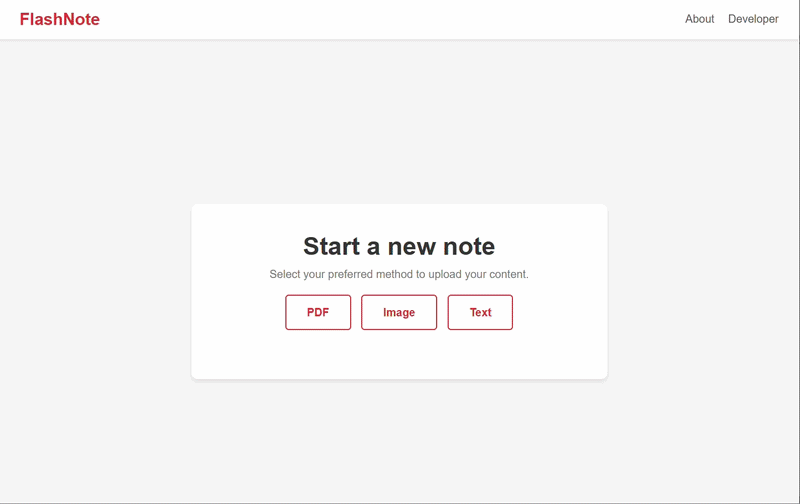
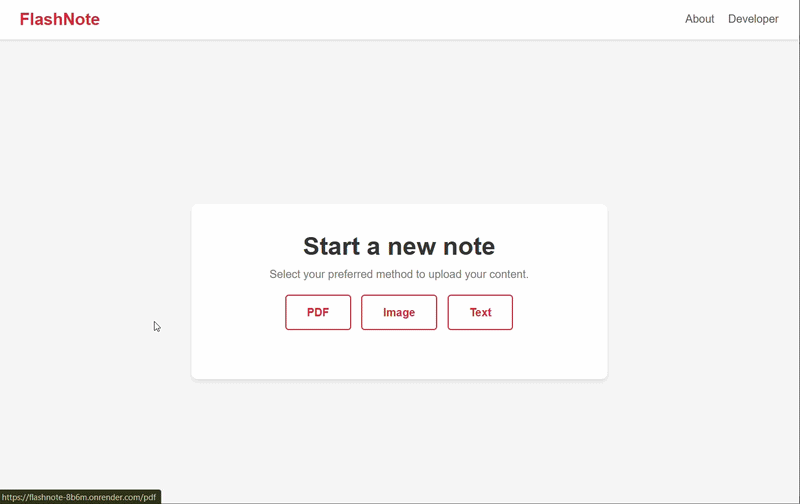
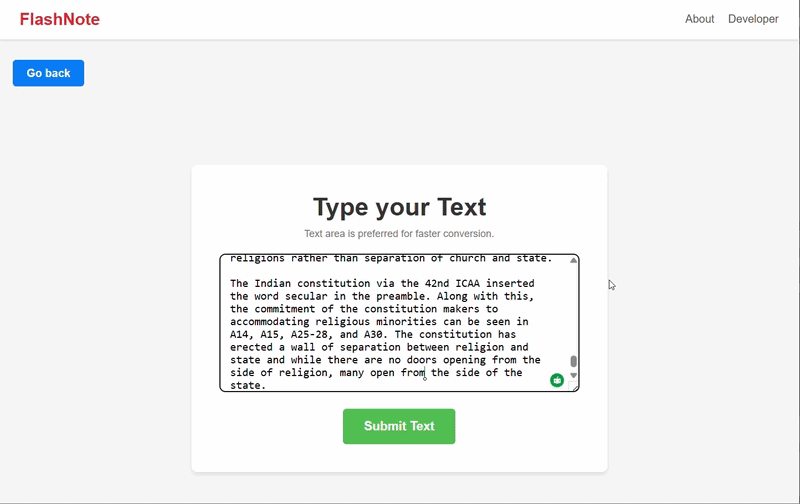

# FlashNote

**An AI-powered application that automatically converts study materials into structured, ready-to-import Anki flashcards.**

---

## Live Demo

**Live Application:** [Visit FlashNote](https://flashnote-8b6m.onrender.com)

> 
*PDF file uploading demo*

> 
*Image file uploading demo*

> 
*Text uploading demo*

---

## Problem Statement

The manual creation of spaced-repetition flashcards is a highly time-consuming process. Learners frequently expend disproportionate effort extracting information, formatting data, and inputting it into systems like Anki, which detracts from the primary objective of studying the core material.

**The Solution:** FlashNote addresses this inefficiency through automation. By utilizing artificial intelligence, the application processes raw study materials—including PDFs, images, and raw text—and instantly generates structured, high-quality Q&A flashcards. This allows users to bypass manual data entry and immediately begin spaced-repetition learning.

---

## Key Features

* **AI-Driven Data Extraction:** Automatically parses complex study materials and structures the extracted knowledge into logical question-and-answer pairs.
* **Versatile Input Processing:** Supports multiple data formats, allowing users to upload PDF documents, images of physical notes, or direct text input.
* **Seamless Anki Integration:** Generates a clean, correctly formatted `.csv` file engineered specifically for direct import into Anki and AnkiDroid environments.
* **Significant Time Optimization:** Reduces a multi-hour manual data entry workflow into an instantaneous, automated process.

---

## Technical Architecture & Stack

FlashNote is built utilizing a lightweight, efficient architecture designed for rapid processing and API integration:

* **Backend Framework (Python & Flask):** Selected to provide a robust, lightweight server environment highly capable of handling file uploads and routing API requests efficiently.
* **Frontend (HTML, CSS, JavaScript):** Utilized to build a responsive, intuitive, and accessible user interface without the overhead of heavy client-side frameworks.
* **AI Engine (Gemini API):** Implemented to power the core natural language processing, ensuring accurate context extraction and logical flashcard generation from diverse text sources.
* **Optical Character Recognition (OCR Space API):** Integrated to accurately extract text data from uploaded image files, enabling the processing of handwritten or photographed notes.

---

## Getting Started

To utilize FlashNote for your study materials:

1. **Select Input Method:** Choose between PDF, Image, or Text on the application interface.
2. **Upload Material:** Provide your source document or text to the system.
3. **Generate & Download:** Process the file and download the resulting Anki-compatible `.csv` file for immediate import into your spaced-repetition software.

---

## Connect & Project Links

* **Live Deployment:** [FlashNote Web App](https://flashnote-8b6m.onrender.com)
* **GitHub Repository:** [Adil-km/FlashNote](https://github.com/Adil-km/FlashNote)
* **Developer Portfolio:** [Adil's Portfolio](https://my-portfolio-gamma-nine-79.vercel.app/)
* **LinkedIn:** [Adil KM](https://www.linkedin.com/in/adil-km)